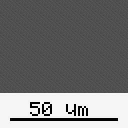
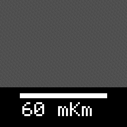
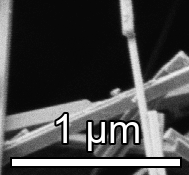
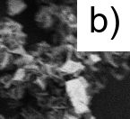

# SEM_scale_bar
SEM_scale_bar is a software for fast processing of images obtained from scanning electron microscope (SEM). The software cuts an info-panel from the image and creates a scale bar according to the image's metadata.

SEM_scale_bar processed all SEM images that it finds in the folder for seconds. By default, English language, a white background for scale bar, and right-down corner are set (just press 'Process' if you don't want to change these settings). The background can also be set to transparent to draw only the bar/label outlines without the filled box; the scale bar outline remains visible on all sides. The "Label" input allows you to put a label on the SEM image in the upper left or right corner, and you can optionally add end ticks to the scale bar. The processed images are saved to the same folder where the original RAM images are located.

SEM_scale_bar is licensed under the General Public Licenses (GPL), which allows all users to use, share, and modify the software freely.

The current version (v4) works with SEM images ("tif" and "png" extensions) obtained from Tescan, Zeiss, LEO, SM-32, and, probably, FEI (Helios) microscopes. The result of LEO image processing must be carefully checked, errors may occur due to incomplete information in the metadata of the microscope of this brand.

The actual version of the software can be downloaded from our lab's web page (http://oxide.ru/?q=content/%D0%BF%D0%BE).

If you are going to publish SEM images processed using SEM_scale_bar in a scientific article, we will be glad if you mark the use of SEM_scale_bar in the "Acknowledgements" section.

## Installation

Use the following example with conda (recommended for compiled dependencies):

```bash
# create + activate
conda create -n sem_scalebar -c conda-forge --yes python=3.10
conda activate sem_scalebar
conda config --env --set channel_priority strict

# compiled stack via conda-forge (prevents the numpy/imagecodecs ABI mismatch)
conda install -c conda-forge --yes numpy imagecodecs tifffile pillow pypng

# GUI via pip if necessary
python -m pip install FreeSimpleGUI
```

## Command-line usage

### Option descriptions

Visual option representation

| Option | English white | Russian, black | English transparent | Custom label |
| --- | --- | --- | --- | --- |
| Visual option representation |  |  |  |  |

### Required vs optional options

The only required CLI argument is the input path (file or folder). All other options are optional and default to English language, a white background (use `transparent` to skip the background box), right scale-bar corner, left label corner, no label text, no end ticks, LZW compression enabled for TIFF outputs, and output saved next to the original files (or in the provided output folder). The output index and standard sizes options are also optional and only need to be set when you want a different filename index or standardized 1-2-5 bar sizes.

Run the CLI directly:

```bash
python -m sem_scale_bar.cli /path/to/image_or_folder \
  --language English \
  --background-color white \
  --scale-bar-corner right \
  --label-text "a)" \
  --label-corner left \
  --end-ticks \
  --output-index 1
```

Disable LZW compression for TIFF outputs:

```bash
python -m sem_scale_bar.cli /path/to/image_or_folder --no-lzw-compression
```

Run the package entrypoint (GUI if available, otherwise CLI). Use `--headless` to force CLI mode:

```bash
python -m sem_scale_bar --headless /path/to/folder
```

### Separate output folder option

Use the `--output-dir` option to send processed images to a separate folder while preserving the input folder structure and original filenames:

```bash
python -m sem_scale_bar.cli /path/to/folder --output-dir /path/to/output
```

In the GUI, enable "Output to separate folder" and choose a folder. If the checkbox is enabled, an output folder must be selected or processing will be blocked.

### Standard 1-2-5 sizes option

Use `--standard-sizes` (CLI) or "Use standard 1-2-5 bar sizes" (GUI) to round the scale bar length to the nearest 1-2-5 sequence (1, 2, 5 × 10^n). This keeps the bar area width consistent while producing standardized scale lengths.

### End ticks option

Use `--end-ticks` (CLI) or "Add end ticks to scale bar" (GUI) to add vertical ticks at the bar endpoints for clearer measurement endpoints.
